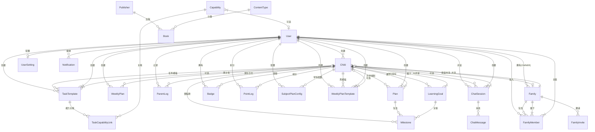

# 趣学伴数据模型文档

> 版本：v2.8.5
> 最后更新：2026-08-09
> 基于 Prisma schema 生成

---

## 1. 核心模型关系图



---

## 2. 核心模型说明

### 2.1 用户与认证

| 模型 | 说明 | 关键字段 |
|---|---|---|
| **User** | 用户账号，家长或管理员 | `id`, `username`, `role`(PARENT/ADMIN), `wechatOpenId`, `bindCode` |
| **UserSetting** | 用户偏好配置（1:1） | `theme`, `appearance`(light/dark/system), `fontSize`, `notificationPrefs` |

### 2.2 家庭体系

```
User (1) ──── 创建 ────→ Family (N)
  │                        │
  │                        ├── FamilyMember (N) ←── User (N)
  │                        │     └── role: OWNER / ADMIN / MEMBER / VIEWER
  │                        │     └── status: INVITED / ACTIVE / DISABLED
  │                        │
  │                        └── FamilyInvite (N)
  │                              └── token, email, phone, expiresAt
  │
  └─── 创建 ────→ Child (N)
                     │
                     └── familyId → Family（可选，共享后关联）
```

| 模型 | 说明 | 关键字段 |
|---|---|---|
| **Family** | 家庭组，由创建者(OWNER)拥有 | `id`, `name`, `createdByUserId` |
| **FamilyMember** | 家庭成员关联表 | `role`, `status`, `invitedBy` |
| **FamilyInvite** | 家庭邀请记录 | `token`(唯一), `email`, `phone`, `expiresAt`, `usedAt` |

### 2.3 孩子管理

| 模型 | 说明 | 关键字段 |
|---|---|---|
| **Child** | 孩子档案，核心数据锚点 | `name`, `grade`, `educationSystem`, `targetSchool`, `wechatOpenId` |
| **LearningGoal** | 学习目标，按学科分类 | `subject`, `goalType`, `metricType`, `target`, `period`, `status` |
| **Plan** | 升学规划路线 | `type`, `status`, `stage`, `probability`(匹配度), `milestones`(JSON) |
| **Milestone** | 里程碑节点 | `title`, `targetGrade`, `status`, `dueDate`, `completedAt` |

### 2.4 任务与周计划

```
User (1) ──── 创建 ────→ TaskTemplate (N)
  │                        └── category: SCHOOL / READING / SPORT / INTEREST / ABILITY / OTHER
  │                        └── taskType: DAILY / MILESTONE / REMEDIAL / SPRINT / DIAGNOSTIC
  │                        └── frequency: ONCE / DAILY / WEEKLY / CUSTOM
  │
  └─── 创建 ────→ WeeklyPlan (N)
                     └── tasks: JSON[]（任务列表）
                     └── goals: JSON[]（目标列表）
                     └── aiSummary: Text（AI 周报总结）
                     └── unique: [childId, weekId]
```

| 模型 | 说明 | 关键字段 |
|---|---|---|
| **TaskTemplate** | 任务模板，可收藏、标记来源 | `title`, `category`, `duration`, `source`(SYSTEM/USER), `isFavorite`, `useCount` |
| **TaskCapabilityLink** | 任务-能力关联（多对多） | `weight`, `expectedProgress` |
| **Capability** | 能力项，按学科分类 | `name`, `category`(CHINESE/MATH/ENGLISH/...), `isSystem` |
| **WeeklyPlan** | 周计划，每周每孩子一份 | `tasks`(JSON), `goals`(JSON), `publishedAt`, `aiSummary` |
| **WeeklyPlanTemplate** | 周计划模板 | `tasks`(JSON), `goals`(JSON), `isDefault` |

### 2.5 成长与游戏化

| 模型 | 说明 | 关键字段 |
|---|---|---|
| **ParentLog** | 家长每日观察记录 | `date`, `content`, `imageUrls`, `tags`，唯一约束 `[childId, date]` |
| **Badge** | 勋章/成就 | `key`, `name`, `level`, `unlockedAt`，唯一约束 `[userId, childId, key]` |
| **PointLog** | 积分变动记录 | `points`, `total`, `reason`, `source` |
| **Notification** | 系统通知 | `title`, `content`, `readAt` |

### 2.6 AI 与对话

| 模型 | 说明 | 关键字段 |
|---|---|---|
| **AiConfig** | 全局 AI 配置（仅 ADMIN 管理） | `provider`, `apiKey`, `apiUrl`, `model`, `isEnabled` |
| **ChatSession** | AI 对话会话 | `title`, 关联 `childId` 可选 |
| **ChatMessage** | 对话消息 | `role`(user/assistant), `content` |

### 2.7 学科与教辅

| 模型 | 说明 | 关键字段 |
|---|---|---|
| **SubjectPlanConfig** | 学科路径配置（JSON 存储） | `subject`, `tracks`(JSON), `timeAxis`(JSON), `nodes`(JSON) |
| **Publisher** | 出版社 | `name`, `shortName` |
| **ContentType** | 教辅内容类型 | `name`, `description` |
| **Book** | 教辅书目 | `title`, `subject`, `grade`, `difficulty`, `publisherId`, `contentTypeId` |

---

## 3. 关键关系说明

### 3.1 周计划唯一约束

```
WeeklyPlan: UNIQUE(childId, weekId)
```
- 每个孩子每周只能有一份计划
- `weekId` 格式：`YYYY-WNN`（如 `2026-W32`）

### 3.2 家长日志唯一约束

```
ParentLog: UNIQUE(childId, date)
```
- 每个孩子每天只能有一条家长日志

### 3.3 勋章唯一约束

```
Badge: UNIQUE(userId, childId, key)
```
- 每个用户/孩子组合的每个勋章 key 只能有一个

### 3.4 家庭成员唯一约束

```
FamilyMember: UNIQUE(familyId, userId)
```
- 一个用户在一个家庭中只能有一个角色

---

## 4. 枚举类型

### 4.1 用户角色

```typescript
enum UserRole { PARENT, ADMIN }
```

### 4.2 家庭角色与状态

```typescript
enum FamilyMemberRole { OWNER, ADMIN, MEMBER, VIEWER }
enum FamilyMemberStatus { INVITED, ACTIVE, DISABLED }
```

### 4.3 任务分类

```typescript
enum TaskCategory { SCHOOL, READING, SPORT, INTEREST, ABILITY, OTHER }
enum TaskType { DAILY, MILESTONE, REMEDIAL, SPRINT, DIAGNOSTIC }
enum TaskFrequency { ONCE, DAILY, WEEKLY, CUSTOM }
enum TaskWeeklySchedule { AUTO, DAILY, WEEKDAYS, WEEKENDS, CUSTOM }
enum TaskTemplateSource { SYSTEM, USER }
```

### 4.4 能力分类

```typescript
enum CapabilityCategory { CHINESE, MATH, ENGLISH, GENERAL, EXAM, ADMISSION }
```

---

## 5. 索引策略

| 模型 | 索引 | 用途 |
|---|---|---|
| User | `role` | 按角色筛选 |
| Child | `userId`, `familyId` | 按用户查询孩子、按家庭查询 |
| WeeklyPlan | `childId`, `userId`, `[childId, weekId]` | 周计划查询 |
| FamilyMember | `familyId`, `userId`, `status` | 家庭权限查询 |
| TaskTemplate | `userId`, `category`, `source`, `isFavorite` | 任务库筛选 |
| Notification | `userId`, `createdAt` | 通知列表 |
| ParentLog | `childId`, `date`, `userId` | 家长日志查询 |
| Book | `subject`, `grade`, `status`, `difficulty` | 教辅搜索 |
| ChatSession | `userId`, `updatedAt` | 会话列表 |
| ChatMessage | `sessionId`, `createdAt` | 消息历史 |
| FamilyInvite | `token`, `email`, `phone`, `familyId` | 邀请验证 |
| Milestone | `childId`, `status`, `routeId` | 里程碑查询 |
| PointLog | `userId`, `childId`, `createdAt` | 积分历史 |
| Badge | `userId`, `childId`, `key` | 勋章查询 |
| SubjectPlanConfig | `subject`, `userId`, `childId` | 学科配置查询 |
| WeeklyPlanTemplate | `userId`, `childId`, `isDefault` | 模板查询 |
| AiConfig | `provider` | AI 配置查询 |
| Capability | `userId`, `category`, `isSystem` | 能力筛选 |
| LearningGoal | `childId`, `status` | 学习目标查询 |
| Plan | `userId`, `childId` | 升学规划查询 |